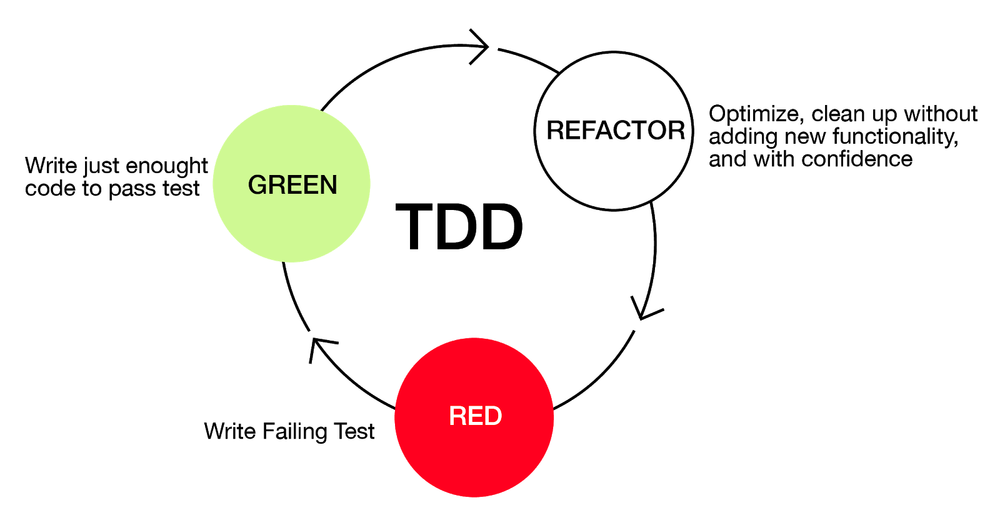

# Unit Testing your C functions with Unity

> We’ve all done it—written a bunch of code and then toiled to make it
work. Build it and then fix it. Testing was something we did after the
code was done. It was always an afterthought, but it was the only way
we knew ~ _Test-Driven-Development for Embedded C by James W. Grenning_

> __Warning__: This is a pretty long tutorial, you can also just look at the code in the repository if you don't feel like reading.

## Contents

1. My experiences.
2. Installing Unity: A unit-test framework for C.
3. An example of the Test-Driven-Development workflow.

## My experiences

Writing unit-tests first, and the functions after worked magical for me. Some positive experiences I had/have:

1. The bugs in my code almost vanished. The few bugs that are present are located very fast thanks to the unit-tests.
2. Because you write the test first, you need to think about the function, it's arguments and return value so that you don't start to code immediately without thinking. This makes my code better and straight to the point.
3. When you refactor your code or try to add small functionalities, the unit tests immediately show you whether you broke your code by changing things.

## Installing Unity: A unit-test framework for C

[Unity](https://github.com/ThrowTheSwitch/Unity) is the unit-testing framework we will be using throughout this tutorial but there are a lot of others as well and they all do the same: Improve you code!

First create a directory for the example we'll cover below:

```sh
mkdir unit_testing_example
cd unit_testing_example/
```

Then clone Unity through GitHub inside of _unit_testing_example_:

```sh
git clone https://github.com/ThrowTheSwitch/Unity.git unity
```

Installing Unity is as simple as that! Now let's go on to an example in which we will be using Unity.

## An example of the Test-Driven-Development workflow.


[Image source](https://www.geeksforgeeks.org/7-code-refactoring-techniques-in-software-engineering/)

_"Test Driven Development (TDD) is software development approach in which test cases are developed to specify and validate what the code will do. In simple terms, test cases for each functionality are created and tested first and if the test fails then the new code is written in order to pass the test and making code simple and bug-free." ~ Thomas Hamilton's article on [guru99](https://www.guru99.com/test-driven-development.html)._

### __Project structure__

The example-project will have the following structure:

```
unit_testing_example/
| ---> 	unity/
|
| ---> 	src/
|		| ---> 	string_join.c
|		| --->	string_join.h
|
| ---> 	test/
|		| ---> 	main/
|		|		| ---> all_tests.c
|		|		| ---> all_tests_runner.c
|		|
|		| ---> 	test_string_join.c
```

### __Function prototype__

We are going to write a string join function in C. We are first going to write a test, before writing our _string_join_ function itself (TDD). So let's thinks about how the function prototype looks like:

```C
char *string_join(char *s1, char *s2);
```

### __Create our first test__

A test case could be the following:

- Input _s1_: "Hello "
- Input _s2_: "World!"
- Output should be: "Hello World!".

Create a _test_ directory and a _test_string_join.c_ file:

```sh
mkdir test
touch test/test_string_join.c
```

Open _test/test_string_join.c_ in your favorite text editor and open one of the toggles below!

<details>
<summary> Detailed explanation of test-code. </summary>

1. First we have to include the _unity_fixture.h_ headerfile to make use of Unity functions.

	```C
	#include "unity_fixture.h"
	```
2. Also include the headerfile of the function we test, in this case _string_join.h_ (we'll create this later).
	```C
	#include "../src/string_join.h"
	```
3. Create a test group called _StringJoin_. Inside of this group we'll create different testcases.
	```C
	TEST_GROUP(StringJoin);
	```

4. Create a test setup and teardown function. Everything you write in _TEST_SETUP_ will execute before each test. Everything you write in _TEST_TEAR_DOWN_ will execute after each test. You could for example free allocated memory after each test. For now, we leave them empty (they have to be present in the test, otherwise it won't compile).

	```C
	TEST_SETUP(StringJoin)
	{
	}

	TEST_TEAR_DOWN(StringJoin)
	{
	}	
	``` 

5. Write our first test using the example above, naming this test _SimpleJoin_ (which belongs to the _StringJoin_ group).

	```C
	TEST(StringJoin, SimpleJoin)
	{
		char *s1 = "Hello ";
		char *s2 = "World!";
		char *joined_string;

		/* Our result */
		joined_string = string_join(s1, s2);

		/* 
		Compare strings with Unity function. 
		First argument is the expected result, the second argument is our result 
		*/
		TEST_ASSERT_EQUAL_STRING("Hello World!", joined_string);
	}
	```

</details>

<details>
<summary> Test-code only. </summary>

```C
/* test_string_join.c */
#include "unity_fixture.h"

/* The interface (headerfile) of the module we are testing (module = C file) */
#include "../src/string_join.h"

TEST_GROUP(StringJoin);

TEST_SETUP(StringJoin)
{
}

TEST_TEAR_DOWN(StringJoin)
{
}	

/* Test Case */
TEST(StringJoin, SimpleJoin)
{
	char *s1 = "Hello ";
	char *s2 = "World!";
	char *joined_string;

	/* Our result */
	joined_string = string_join(s1, s2);

	/* 
	Compare strings with Unity function. 
	First argument is the expected result, the second argument is our result 
	*/
	TEST_ASSERT_EQUAL_STRING("Hello World!", joined_string);
}
```
</details>

### __Setting up the main function for Unity__

Create main directory:

```sh
mkdir test/main
touch test/main/all_tests.c
touch test/main/all_tests_runner.c
```

<details>
<summary> Code for all_tests.c </summary>

To execute all our tests, we need a main. Luckily, Unity has a main for us.

We use the UnityMain function, with a function pointer to run_all_tests. This selects all test-groups to run.

```C
/* all_tests.c */

#include "unity_fixture.h"

/* Which test groups to run */
static void	run_all_tests(void)
{
	RUN_TEST_GROUP(StringJoin);
}

int	main(int argc, const char *argv[])
{
	return (UnityMain(argc, argv, run_all_tests));
}
```

We only have one group _StringJoin_. If you test more functions, you would create more groups and add them inside the _run_all_tests_ function.

</details>

<details>
<summary> Code for all_tests_runner.c </summary>

We have to specify which tests to run in each group. 

```C
/* all_tests_runner.c */
#include "unity_fixture.h"

/* Which tests to run in StringJoin group */
TEST_GROUP_RUNNER(StringJoin)
{
	RUN_TEST_CASE(StringJoin, SimpleJoin);
}
```

For now, we only have the _SimpleJoin_ test. We will add more later.
</details>

### __string_join function__

Now that we have our first simple test ready, let's write the first version of our _string_join_.

Create the source files and directory:

```sh
mkdir src/
touch src/string_join.c
touch src/string_join.h
```

<details>
<summary> Code string_join.c </summary>

```C
/* string_join.c */
# include "string_join.h"

char *string_join(char *s1, char *s2)
{
	size_t	i;
	size_t	len_s1;
	size_t	len_s2;
	char 	*joined_string;

	i = 0;
	len_s1 = strlen(s1);
	len_s2 = strlen(s2);
	joined_string = calloc(len_s1 + len_s2 + 1, sizeof(*joined_string));
	if (joined_string == NULL)
		return (NULL);
	while (i < len_s1 + len_s2)
	{
		if (i < len_s1)
			joined_string[i] = s1[i];
		else
			joined_string[i] = s2[i - len_s1];
		i++;
	}
	joined_string[i] = '\0';
	return (joined_string);
}
```
</details>

<details>
<summary> Code string_join.h </summary>
It is a good practice to have a headerfile for each module (a module is a single C file). In this case, we consider _string_join_ as a module.

```C
/* string_join.h */

#ifndef STRING_JOIN_H
# define STRING_JOIN_H

/* System header */
# include <stdlib.h>	/* calloc() */
# include <string.h>	/* strlen() */

/* Function prototypes */
char *string_join(char *s1, char *s2);

#endif
```

</details>

### __Compilation__

> You can also check the [Makefile](https://github.com/hilmi-yilmaz/blogs/blob/main/unit-testing-C/Makefile) in the repo to see how the compilation works. Run `make test` to create the `test_exec` executable. Or run `make test_run` to create and run the tests.

We have all necessary source files and tests, but how to compile?

```sh
gcc -Wall -Wextra -Werror -D UNITY_OUTPUT_COLOR -D UNITY_FIXTURE_NO_EXTRAS -I./unity/src -I./unity/extras/fixture/src unity/src/unity.c unity/extras/fixture/src/unity_fixture.c test/main/all_tests.c test/main/all_tests_runner.c test/test_string_join.c src/string_join.c -o test_exec
```

- `-D UNITY_OUTPUT_COLOR`						: Output red and green colors for fails and successes respectively.
- `-D UNITY_FIXTURE_NO_EXTRAS`					: Disable memory handling by Unity. Read more about it [here](https://github.com/ThrowTheSwitch/Unity/tree/master/extras/memory).
- `-I./unity/src`								: Path to Unity headerfile.
- `-I./unity/extras/fixture/src`				: Path to another necessary headerfile.
- `unity/src/unity.c`							: Unity source file.
- `unity/extras/fixture/src/unity_fixture.c`	: Another necessary source file.
- `test/main/all_tests.c`						: The main function of our tester.
- `test/main/all_tests_runner.c`				: The group runner for our tester.
- `test/test_string_join.c`						: The tests for _string_join_.
- `src/string_join.c`							: The source code of _string_join_.
- `-o test_exec`								: Executable name is _test_exec_.

__run tester__:

```sh
./test_exec -v
```

The `-v` option makes the output more verbose (it shows you what tests you passed, which gives me a good feeling).

Congratulations, you have written your first unit-test! We are done with the setup, let's add more tests and adjust code accordingly.

### __More tests__

<details>
<summary> Test-code with more tests </summary>

```C
/* test_string_join.c */
#include "unity_fixture.h"

/* The interface (headerfile) of the module we are testing (module = C file) */
#include "../src/string_join.h"

TEST_GROUP(StringJoin);

TEST_SETUP(StringJoin)
{
}

TEST_TEAR_DOWN(StringJoin)
{
}	

/* Test Case */
TEST(StringJoin, SimpleJoin)
{
	char *s1 = "Hello ";
	char *s2 = "World!";
	char *joined_string;

	/* Our result */
	joined_string = string_join(s1, s2);

	/* 
	Compare strings with Unity function. 
	First argument is the expected result, the second argument is our result 
	*/
	TEST_ASSERT_EQUAL_STRING("Hello World!", joined_string);
}

TEST(StringJoin, JoinWithS1EmptyString)
{
	char *s1 = "";
	char *s2 = "World!";
	char *joined_string;

	/* Our result */
	joined_string = string_join(s1, s2);

	/* 
	Compare strings with Unity function. 
	First argument is the expected result, the second argument is our result 
	*/
	TEST_ASSERT_EQUAL_STRING("World!", joined_string);
}

TEST(StringJoin, JoinWithS2EmptyString)
{
	char *s1 = "Hello ";
	char *s2 = "";
	char *joined_string;

	/* Our result */
	joined_string = string_join(s1, s2);

	/* 
	Compare strings with Unity function. 
	First argument is the expected result, the second argument is our result 
	*/
	TEST_ASSERT_EQUAL_STRING("Hello ", joined_string);
}

TEST(StringJoin, JoinWithBothS1AndS2EmptyString)
{
	char *s1 = "";
	char *s2 = "";
	char *joined_string;

	/* Our result */
	joined_string = string_join(s1, s2);

	/* 
	Compare strings with Unity function. 
	First argument is the expected result, the second argument is our result 
	*/
	TEST_ASSERT_EQUAL_STRING("", joined_string);
}

TEST(StringJoin, InputNullForS1)
{
	char *s1 = NULL;
	char *s2 = "World!";
	char *joined_string;

	/* Our result */
	joined_string = string_join(s1, s2);

	/* Check whether joined_string is NULL pointer */
	TEST_ASSERT_NULL(joined_string);
}
```

</details>

<details>
<summary> Add tests to group runner all_tests_runner.c </summary>

```C
/* all_tests_runner.c */
#include "unity_fixture.h"

/* Which tests to run in StringJoin group */
TEST_GROUP_RUNNER(StringJoin)
{
	RUN_TEST_CASE(StringJoin, SimpleJoin);
	RUN_TEST_CASE(StringJoin, JoinWithS1EmptyString);
	RUN_TEST_CASE(StringJoin, JoinWithS2EmptyString);
	RUN_TEST_CASE(StringJoin, JoinWithBothS1AndS2EmptyString);
	RUN_TEST_CASE(StringJoin, InputNullForS1);
}
```
</details>
<br>

> If you run the _InputNullForS1_ test, you will get a segfault because of the NULL pointer as input we are trying to dereference. Go back to the _string_join_ function and fix the problem, then run all tests again to see if you fixed it!

### __Unity Assertions__
You can compare much more than strings and NULL pointers. For example, structs, integers, arrays etc. You can find them all [here](https://github.com/ThrowTheSwitch/Unity/blob/master/docs/UnityAssertionsReference.md).

## Conclusion
---

Using unit-tests is as important as writing the code itself. I see the tests as a harnass for your code, they protect it, once the harnass breaks, you have to repair it. The basic workflow is described below.

1. Create simple test.
2. Write the function.
3. Make the first test pass.
4. Refactor code.
5. Add tests.
6. Adjust code.
7. Step 4.

## Last Words
---
I hope you learned from this tutorial and you will be using unit-tests yourself. If you have any questions or find something that isn't working, you can send me an email on hilmiyilmaz.1998@gmail.com. If you are part of the 42 Network, you can send me a slack message too (_hyilmaz_).